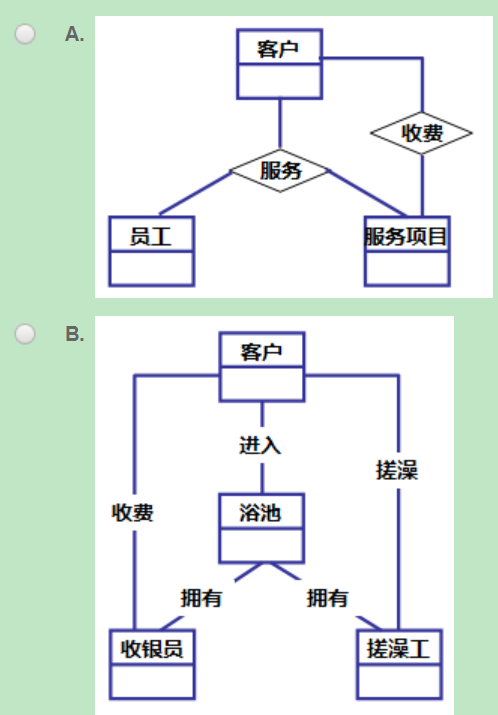
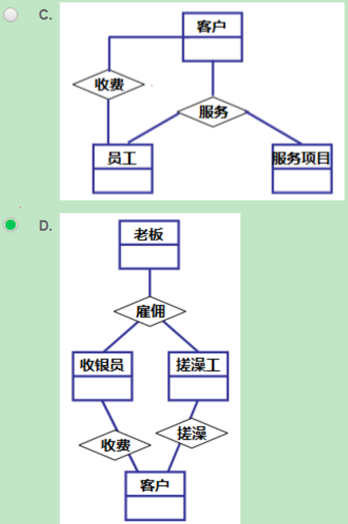

## 数据库系统(中)

### 知识

#### 第1讲：数据建模：思想与方法(暨数据库设计之抽象与表达方法)

感觉没啥好复习的，注意看题就行

#### 第2讲:数据建模：工程化方法及案例分析

1、IDEF([参考博客](https://blog.csdn.net/qq_59954212/article/details/124142508))

- IDEF1x的元素组成与ER模型类似，包括了实体（用盒子表示）、实体之间的关系（连线表示 ）、实体的属性（盒子内的矩形文本表示）。

- 实体：实体是指客观世界具有相同属性和特征的客观或抽象事物的集合，集合中的一个元素就是一个实体的一个“实例”。

  - 独立实体：该实体的唯一标识不依赖与其他实体；
  - 从属实体：该实体的唯一主键依赖于其他实体的属性。(独立实体为使用直角方形框；从属实体使用圆角方形框。)

- 实体之间的关系

  - 连接联系:在于父实体与子实体对应关系为1对0、1对1或者1对多，只有当父实例存在，子实体才能存在。又分为标定联系与非标定联系

    连接联系中又可分为标定联系与非标定联系。

    标定联系：子实体主关键字是父实体主关键字的一部分；

    非标定联系：父实体主关键字作为子实体的外键。

  - 非确定性关系：非确定性关系又称为“多对多关系”，两个实体间相互存在一对多的联系。

  - 分类联系：表示实体中分层结构，主实体由多个分类实体构成，分类联系可以分为完全分类联系与不完全分类联系。

    完全分类联系→指主实体的每一个实例都可以是某个分类实体的实例，例如学生可以分类为男学生、女学生；

    不完全分类联系→存在一个主实体的实例不在分类实体的实例中，例如：学生分类为大一学生、大二学生，该分类不完全包括了所有学生。

#### 第3讲：数据库设计过程

1、关系数据库设计

- 需求分析阶段：收集需求和整理理解需求
- 概念数据库设计阶段：创建E-R图/IDEF1x图
- 逻辑数据库设计阶段：关系模式设计，建立逻辑模型
- 物理数据库设计阶段：用“Create Table”创建表及其索引

2、E-R模型转换为关系模式的转换规则有：

- 1∶1联系一般是将联系与任意一端实体所对应的关系模式合并,即在一个实体的关系模式的属性中加入另一个实体的码和联系本身的属性。
- 1∶n联系一般与n端所对应的关系模式合并,即在n端对应的关系模式中加入1端实体的码以及联系本身的属性。
- m∶n联系必须转换为一个独立的关系模式。与该联系相连的各实体的码以及联系本身的属性均转换为此关系模式的属性,且关系模式的主码包含各实体的码。
- 有相同主码的关系模式可以合并。

3、实体 -> 关系：

①实体的属性 -> 关系的属性
②实体的关键字 -> 关系的关键字
③复合属性 -> 分量属性或复合属性本身作为关系的属性
④多值属性 -> 将多值属性和实体的关键字组成一个新的关系
⑤弱实体(从属实体) -> 属性要包含强实体的关键字
⑥泛化实体、具体化实体 -> 具体化实体属性要包含泛化实体关键字。（若泛化实例是具体化实例的全部，可不创建泛化实例的关系）

### 错题

1、若要为一个浴池开发信息系统，有搓澡工、收银员等，请仔细理解需求，并用E-R图表达需求。则E-R图表达需求，相对最正确的是________A__。

‌
‌

```
A、该选项所发现的实体“客户”“员工”“服务项目”都是正确的，该选项建立的是客户和服务项目之间的联系，表明哪一个客户为哪些服务项目支付费用，从应用的角度该选项的联系更为重要，故该选项正确。  B、这是为某一个浴池开发信息系统，在此背景下，“浴池”也不能用一个个类似的重叠量词来形容，应不是实体，故不正确。  
C、该选项所发现的实体“客户”“员工”“服务项目”都是正确的，与正确答案相比两者所不同的是“收费”这个联系，该选项建立的是客户和员工之间的联系，表明哪一个员工收取哪一个客户的费用。  
D、在此问题中“老板”不能用一个个类似的重叠量词来形容，应不是实体，故不正确。
```

2、若要对E-R图

中“班主任”联系进行处理，说法正确的是___D______。

```
A.
需要建立一个“班主任”的关系；


B.
不需要建立“班主任”关系，也不需任何处理； 


C.
不需要建立“班主任”关系，但需要做处理，即将“学生”实体的关键字作为“教师”实体对应关系的属性；


D.
不需要建立“班主任”关系，但需要做处理，即将“教师”实体的关键字作为“学生”实体对应关系的属性；
```

关于E-R 图向关系模式的转换的规则正确的是_________。

```
A.
泛化实体与具体化实体在转换时，可以不要泛化实体，而仅将具体化实体转换成关系；


B.
一对一联系的转换只能将联系定义为一个新的关系，再将属性设为参与双方的关键字属性；


C.
一对多联系的转换，需将多方参与实体的关键字作为单方参与实体对应关系的属性。


D.
复合属性转换时只能将每个分量属性作为所在实体对应关系的属性；

答案：
A该选项的说法是正确的，泛化实体与具体化实体在转换过程中，可以仅将具体化实体转换成关系。 

D、该选项说法不正确，复合属性转换时，有两种方案并非单一一种，即：或者仅将分量属性转换到关系的属性，或者可将复合属性作为单一属性转换到关系的属性；
```

